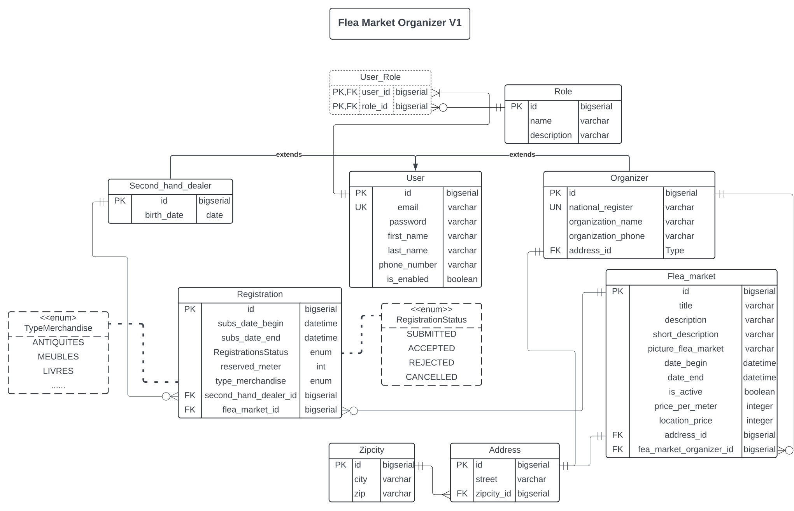

# Flea Market Back-end Application

Java Backend Project Using Spring Boot

## Entity Relationship Diagram - v1 

## Technologies used

* [Spring Boot](https://start.spring.io/) - Framework Java (back-end)
* [IntelliJ Idea Ultimate](https://www.jetbrains.com/idea/) - Integrated Development Environment
* [Lucidchart](https://www.lucidchart.com/) - Sketching, Diagrams

## Links

* [Postman](https://www.postman.com/)
* [GitHub Repo](https://github.com/keivy-git/tftic-labo-solo-back)
* [Lucidchart DB Scheme](https://lucid.app/lucidchart/1e46af63-bf36-4c3a-9403-d64a0de8f505/edit?viewport_loc=-2004%2C-3%2C2466%2C1196%2C0_0&invitationId=inv_47d2c717-0833-4a51-9e90-6f9bcc81a03e)

